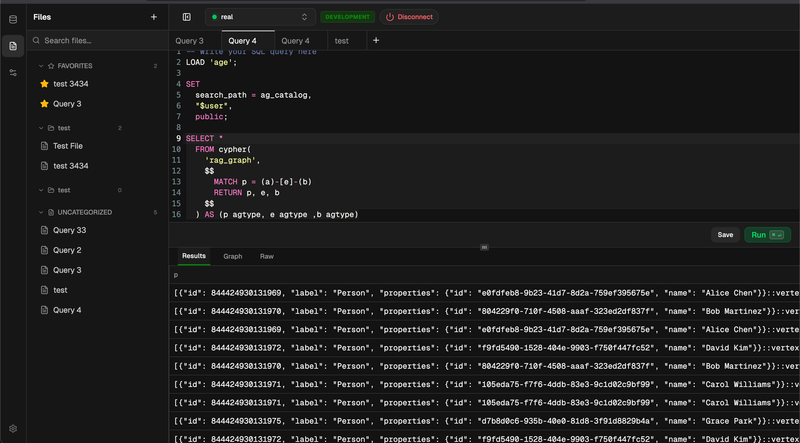
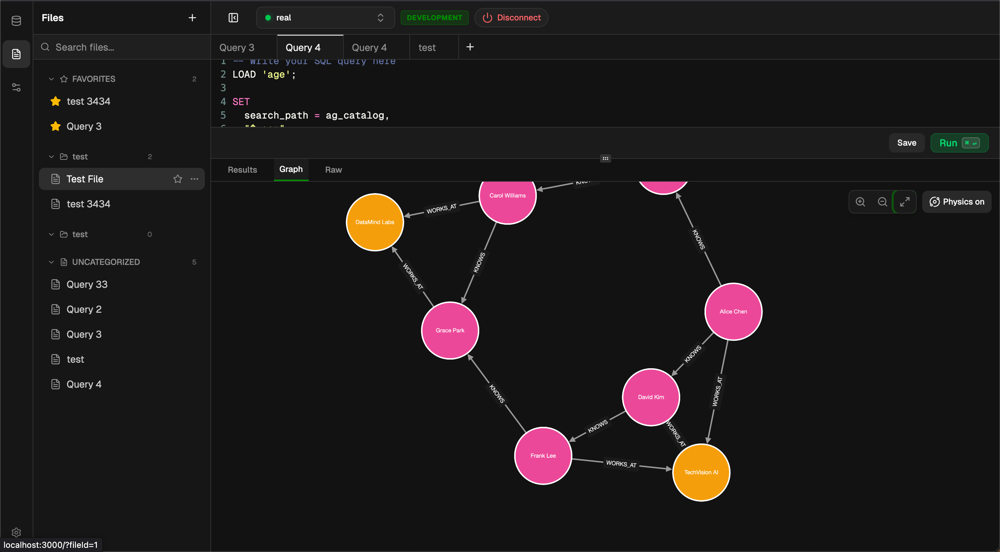

# SQL Graph Viewer

A modern, fast database viewer for Apache AGE (PostgreSQL-based graph database). Built with Bun, Elysia, and React.




## Features

- **Standardized Connections**: Manage and save multiple database connection profiles.
- **Session Management**: Transparent handling of active database sessions.
- **Graph Visualization**: Interactive graph rendering for AGE query results.
- **Query Editor**: Powerful SQL/Cypher editor with syntax highlighting.
- **Modern UI**: Sleek, responsive design built with Tailwind CSS and shadcn/ui.

## Getting Started

### Prerequisites

- [Bun](https://bun.sh) installed on your system.
- A PostgreSQL instance with the [Apache AGE](https://age.apache.org/) extension installed.

### Setup

1. **Install Dependencies**:
   ```bash
   bun install
   ```

2. **Initialize Database**:
   This command creates the local storage for your connections and runs the necessary schema setup.
   ```bash
   bun run init
   ```

### Running the App

Start the development server:
```bash
bun dev
```

Open [http://localhost:3000](http://localhost:3000) in your browser.

## Tech Stack

- **Runtime**: Bun
- **Server**: ElysiaJS
- **Frontend**: React, React Router
- **Styling**: Tailwind CSS
- **Components**: shadcn/ui
- **ORM**: Drizzle (SQLite for local configuration)
- **Graph**: React Flow / Cytoscape.js
